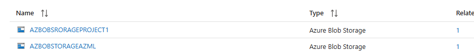
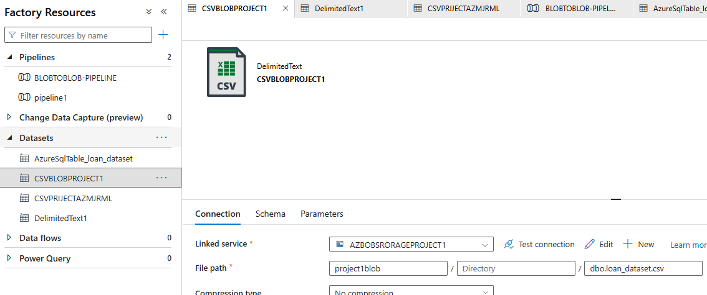
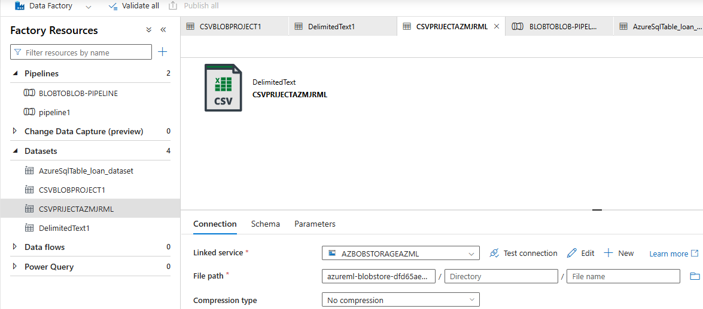
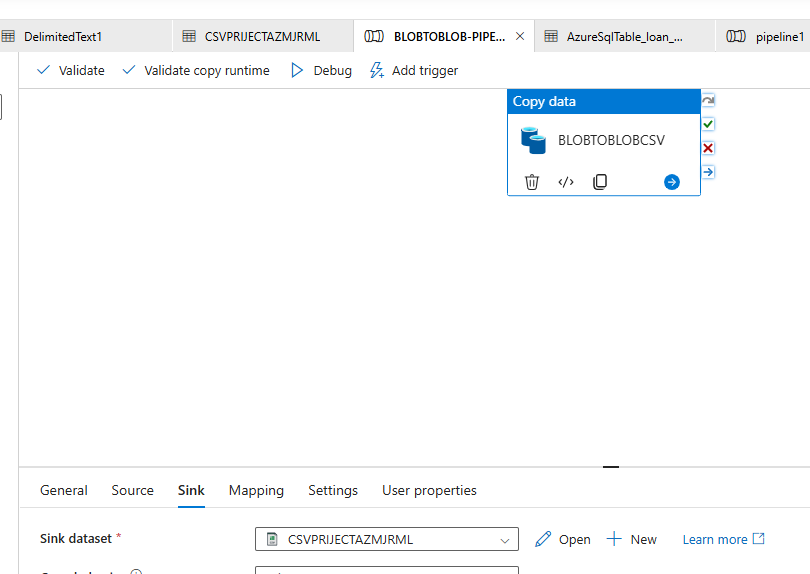

# Use Azure Data Factory to copy our dataset from a Blob Storage Container to the Azure ML Blob Storage container

## Step1 : Use Azure Data Factory to copy the needed file from Azure Blob Storage to the Azure Machine Learning Blob Storage 

- Create Linked Services in Azure Data Factory, the first link is to the Project1 Storage account, the source that holds the dataset we want to copy
- The second link is to the Azure Machine Learning blob storage which is automatically created when you create an Azure Machine Learning workspace 

- Next Create your datasets in the Author tab
- One for the source dataset – outlining the file path

- The second to the destination file path location – azure machine learning blob storage path

- Finally create your copy pipeline, configuring your Source dataset and your sink dataset
- Configuring the Azure Blob Storage as your source and the sink dataset is Azure ML Blob Storage

- The dataset is copied over to the Azure Machine Learning Blob Storage
