# Azure Machine Learning Real-Time Endpoint deployment and testing

## Step1: Create data asset in Azure Machine Learning workspace with the file we just transferred using Azure Data Factory

- In your azure workspace open Data Data assets and create
- Name your file and Type will be Tabular

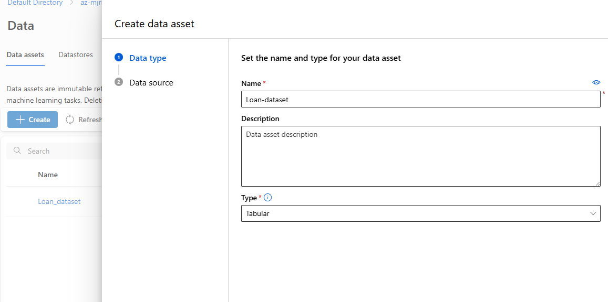

- Select Azure Storage and select AzureBlobStoarge

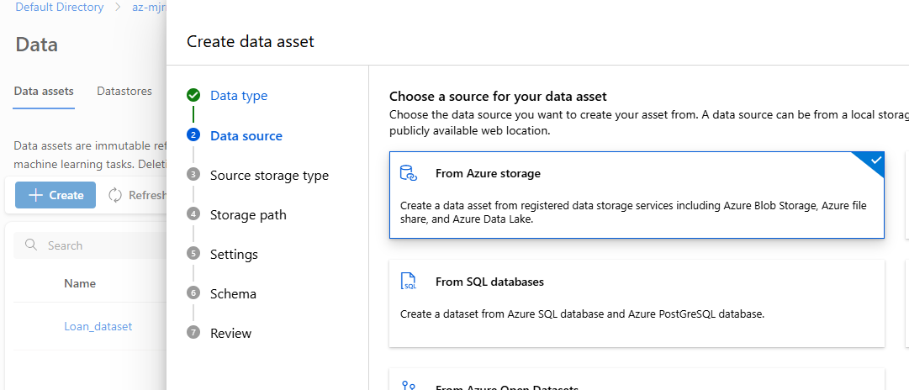

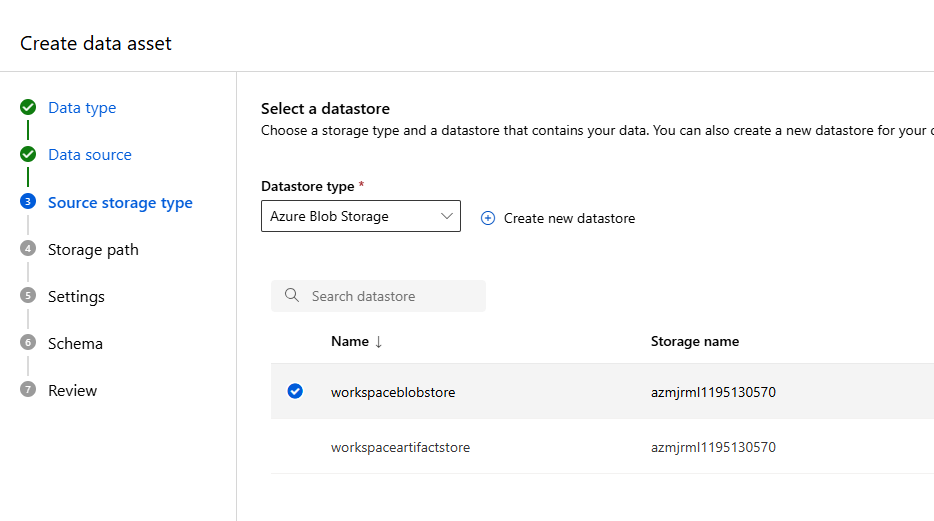

- Choose the file we have transfered to the Azure ML Blob Storage container using Azure Data Factory

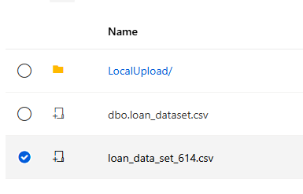

- Review your file settings
- Note: Make sure your Headers are included in the Document – An issue I had with Azure Data Factory were headers not copying and I had to do the Azure Data factory copying process again – make sure “columns headers: All files have same headers” is selected.

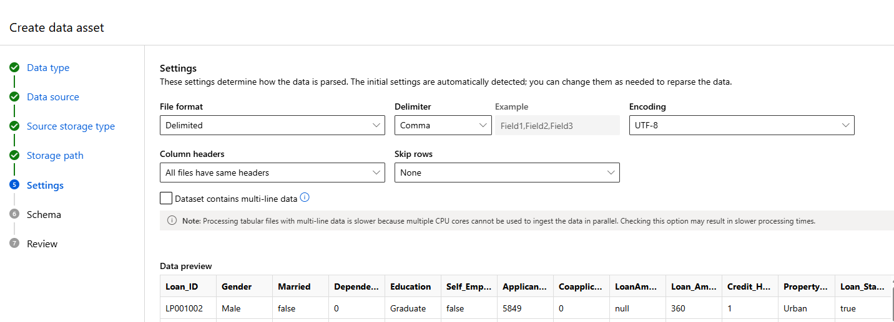

- Review your Schema and remove any columns of data that are not needed like ‘Loan_ID” but I will save this for the Python Pre-Processing Stage in the Notebook
- **NOTE: THIS IS IMPORTANT – ANY DATA COULMN THAT HAS ‘YES’ OR ‘NO’ AZURE MACHINE LEARNING AUTOMATICALLY CHANGES THESE TO TRUE AND FALSE
  IF YOU ARE DOING ANY MANUAL ONE HOT ENCODING USING THE MAP METHOD – YOU WILL HAVE TO ENTER TRUE OR FALSE FOR 1 AND 0**

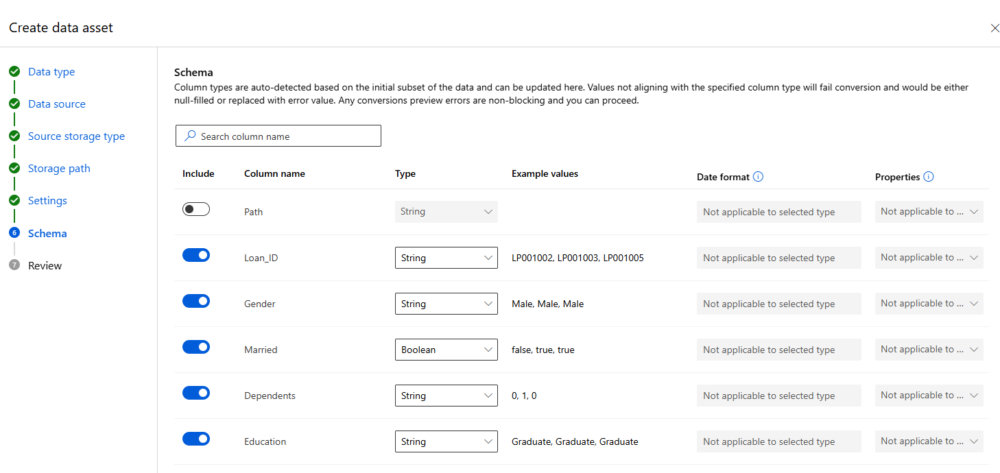

## Step 2: Create your Compute Instance and Notebook in Azure Machine Learning

- Go to compute and select compute Instance and new and fill in the details

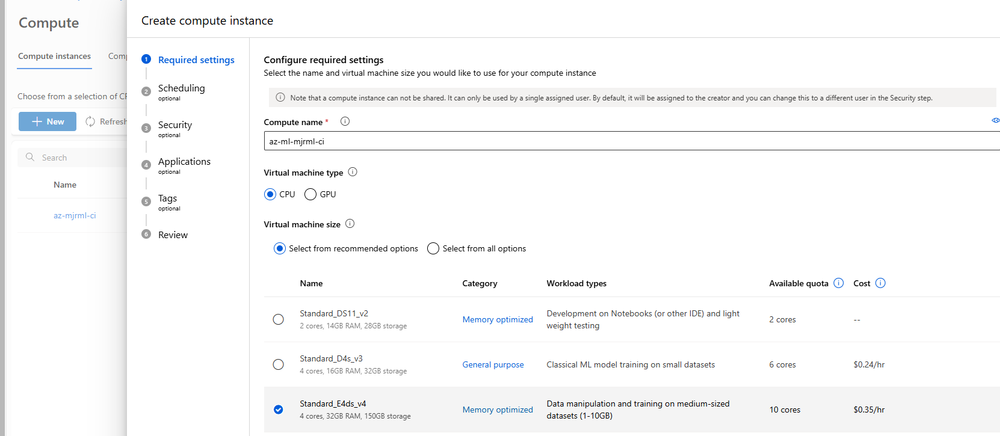

- REMEMBER to add scheduling – if your compute instance is idle for an hour it will shutdown – saving you on the cost

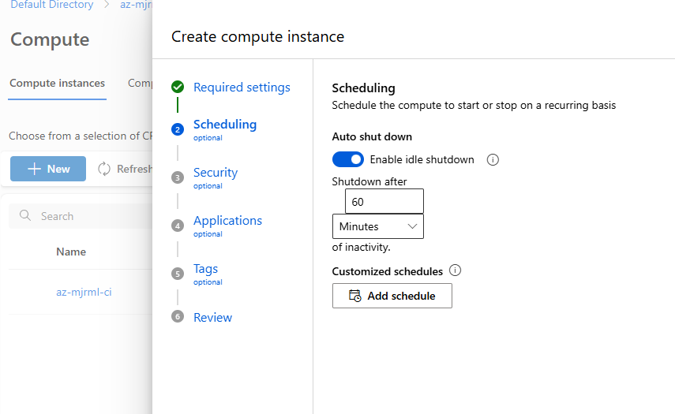

- Once your Compute Instance is up and running – open a notebook

-In This notebook, this is where we will Pre-Process our data and a Logistic Model on our data

- When our Logistic Regression model is trained, we create a pickle File for our model to be called and ingest new data when we create a real-time endpoint using this model

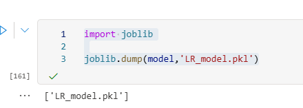
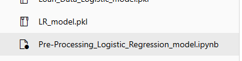

- Next we register this model in our Azure Machine Learning workspace, this is the model we will use to create a Real-Time Endpoint – to ingest our new data and 
  return a result 
- I had some issues with installing packages needed but I have added that code into the notebook
- We register our model in our workspace

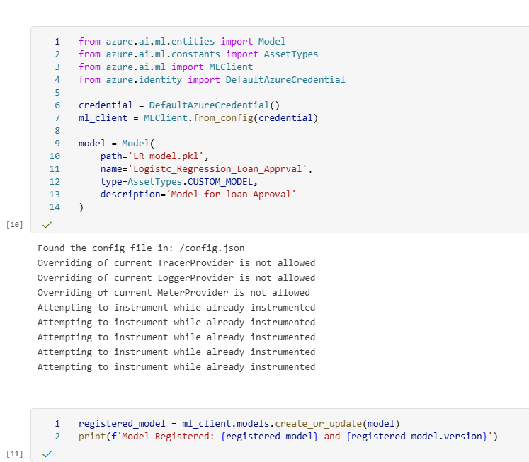
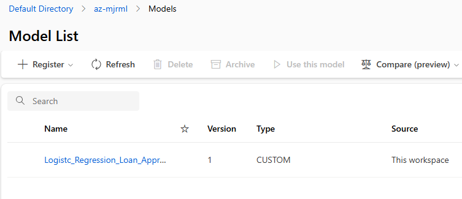

## Step3: Create an environment using a docker image and a conda.yaml file

- We create an environment in which our model will run – we use a standard Ubuntu image and a conda yaml file outlining all the required dependencies needed in our 
  environment
- Select Environments and new custom environment 
- Enter a name and “Select environment source” -- > Using existing docker image with optional conda file

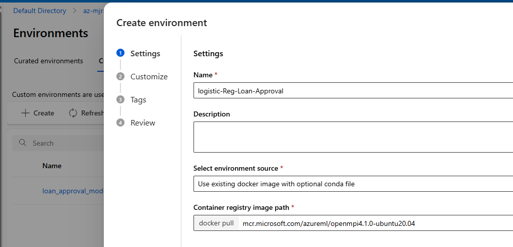

- Next we add the dependencies to the conda file and create our Enviroment

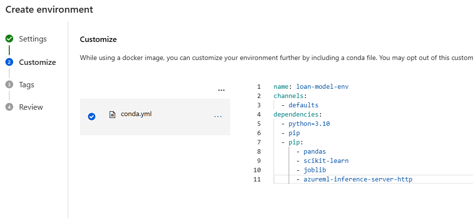

## Step4:  Create a score.py script and create the Real-Time endpoint from the deploy wizard

- I have added the score.py script to this repository
- You create a score.py file to define how the model should be used to make predictions.
-	Loads your trained model
-	Accepts input data
-	Uses the model to generate predictions  

- init()	Loads the model once when the service starts (for performance).
- run(data)	Runs every time a prediction request comes in. It processes the input, runs inference, and returns the result.

- Open our model list and select our registered model and select the Real-Time endpoint deployment wizard

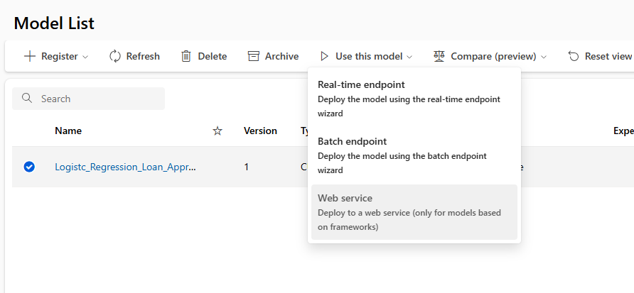

- Enter an endpoint name and compute type will be managed for this project and Auth Type will be key-based
- Select your model

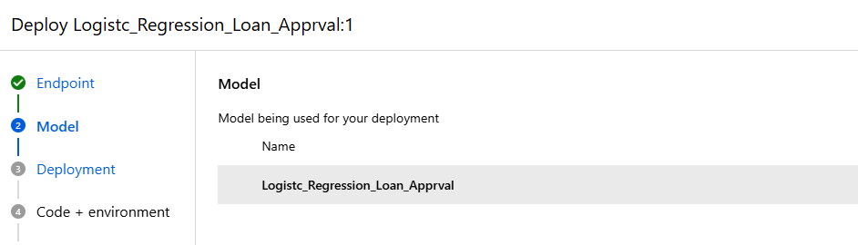

- Enter a deployment name

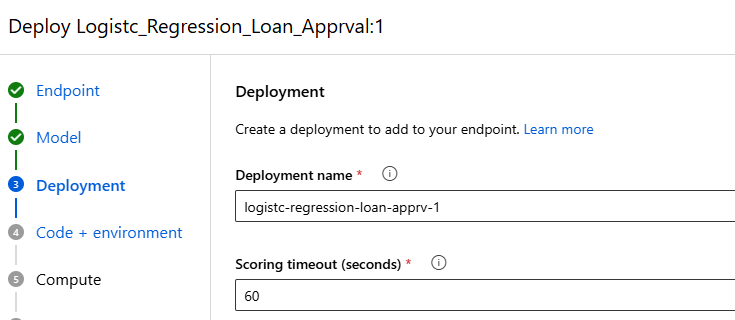

- Next, add the scoring script for inferencing – select your score.py file that you have created and select the custom environment we created in the steps before

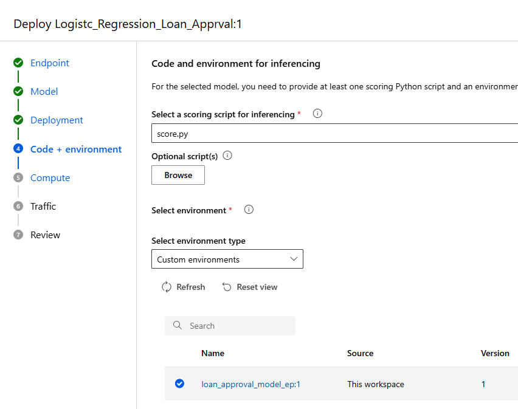

- Configure your compute – Select an instance count of 2, its perfect for testing and not expensive – takes a bit longer but overall saves money

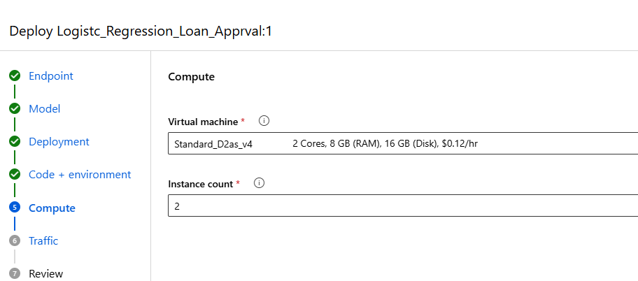

- We are not performing an A/B testing so we can allocate 100% of the traffic
  
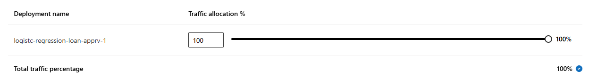

-  Review and create

## Step 5: Testing our Real-Time Endpoint with unseen data

- Open your endpoint in the Endpoint tab

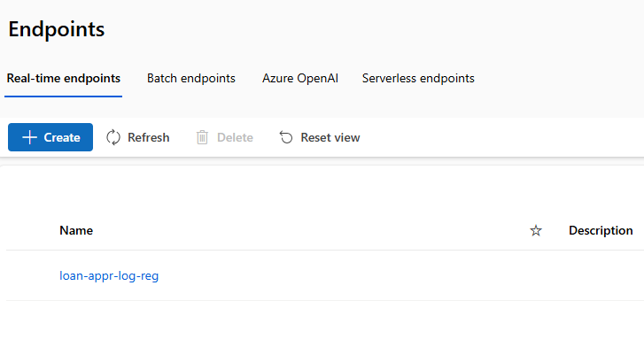

- Here we can test our Real-Time endpoint with unseen data to return a result
- When entering the Json structured data, note the data has to be in the same order the model was trained

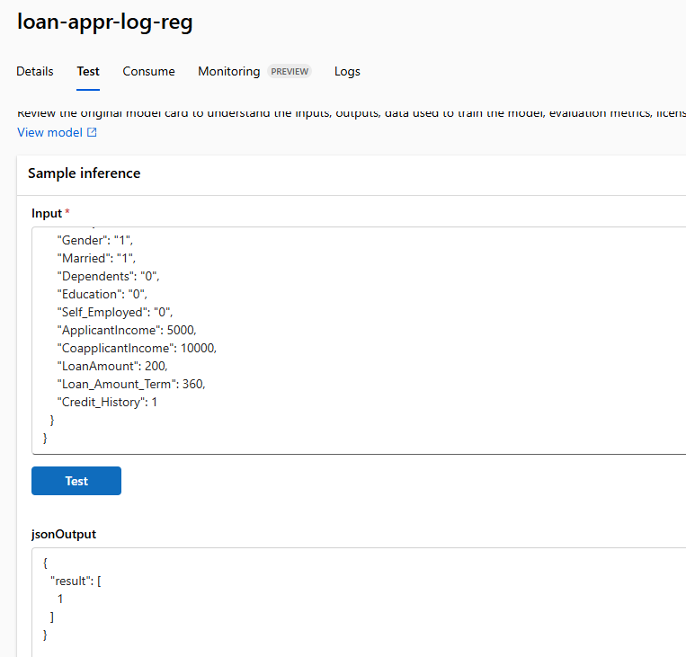

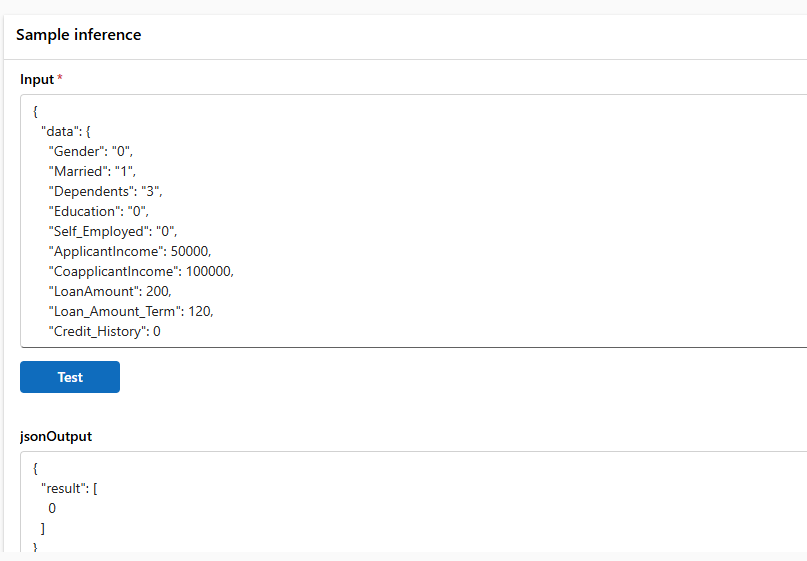

- We have the option to use this Real-Time endpoint using a REST-API which can be found under the consume tab
