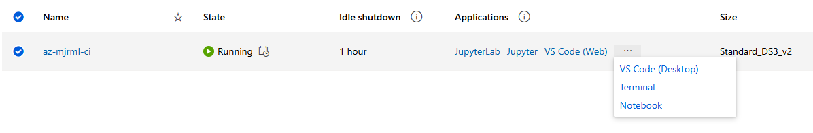

# Azure Machine Learning Real-Time Endpoint deployment and testing

## Step1: Create data asset in Azure Machine Learning workspace with the file we just transferred using Azure Data Factory

- In your azure workspace open Data Data assets and create
- Name your file and Type will be Tabular

- Select Azure Storage and select AzureBlobStoarge

- Choose the file we have transfered to the Azure ML Blob Storage container using Azure Data Factory

- Review your file settings
- Note: Make sure your Headers are included in the Document – An issue I had with Azure Data Factory were headers not copying and I had to do the Azure Data factory copying process again – make sure “columns headers: All files have same headers” is selected.

- Review your Schema and remove any columns of data that are not needed like ‘Loan_ID” but I will save this for the Python Pre-Processing Stage in the Notebook
- **NOTE: THIS IS IMPORTANT – ANY DATA COULMN THAT HAS ‘YES’ OR ‘NO’ AZURE MACHINE LEARNING AUTOMATICALLY CHANGES THESE TO TRUE AND FALSE
  IF YOU ARE DOING ANY MANUAL ONE HOT ENCODING USING THE MAP METHOD – YOU WILL HAVE TO ENTER TRUE OR FALSE FOR 1 AND 0**

## Step 2: Create your Compute Instance and Notebook in Azure Machine Learning

- Go to compute and select compute Instance and new and fill in the details

- REMEMBER to add scheduling – if your compute instance is idle for an hour it will shutdown – saving you on the cost

- Once your Compute Instance is up and running – open a notebook

-In This notebook, this is where we will Pre-Process our data and a Logistic Model on our data

- When our Logistic Regression model is trained, we create a pickle File for our model to be called and ingest new data when we create a real-time endpoint using this model

- Next we register this model in our Azure Machine Learning workspace, this is the model we will use to create a Real-Time Endpoint – to ingest our new data and 
  return a result 
- I had some issues with installing packages needed but I have added that code into the notebook
- We register our model in our workspace

## Step3: Create an environment using a docker image and a conda.yaml file

- We create an environment in which our model will run – we use a standard Ubuntu image and a conda yaml file outlining all the required dependencies needed in our 
  environment
- Select Environments and new custom environment 
- Enter a name and “Select environment source” -- > Using existing docker image with optional conda file

