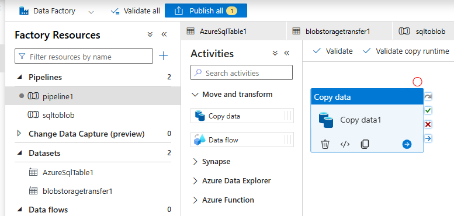

## Transfer Data to Azure Blob Storage via Azure Data Factory

A pipeline in Azure Data Factory extracts the data from Azure SQL Database and writes it to a specified container in Azure Blob Storage in CSV format.

## Step 1 - Setting Up Azure Datafactory in the Azure Portal

- Login to portal.azure.com and open Data Factories 
- Select Create
- Fill in the fields – creating resource group if needed and name your instance

- Select Configure Git later as its not needed right now for this project
- Review and Create

- Once your data factory resource has been created –> open your resource and select launch studio which will open the Azure Data Factory Studio

  

## Step 2: Configure Azure Data Factory

### Configure Linked Services
- Now onto to the fun part of using Azure Data Factory
- As we are transferring data from Azure SQL Database to Blob Storage we have to create two linked services to define the source and destination connections 
- Source will be our Azure SQL Database that we created earlier and destination will be Azure Blob Storage (Stoarge Account container)

- Click new and select Azure SQL Database and from the drop down list select your Azure Subscription, Server name and Database name that we want to copy the data from
- Fill in Username and Password and select Authentication type

- Test your connection to confirm it is working

- Do the same for the Azure Blob Storage, connecting with Storage account key, SAS token or managed identity

- Test connection again

### Conifgure Datasets 

- Next we create a dataset for Azure SQL DB and Blob Storage in the Author tab
- Select new dataset and select Azure SQL server
- Fill in the fields of the SQL linked service and the table we are copying

- Do the same for the Azure Blob Storage – this requires more information
- Select new dataset and select Azure Blob Storage and Delimited CSV

- Select a name -- > The linked service you created and file path to your Blob Storage container
- The path to your Blob Storage container is enough for the path

- Once created you can set the header, Column Delimiter, Row Delimiter and Compression if you are transferring big files.

### Configure Pipeline

- Lastly we create the copy Pipeline in the Author tab
- Select new pipeline, select move and transform and drag copy data onto the canvas

- Set your source as your Azure SQL Database
- Here you can add a Query or Stored Procedure but I will select Table (full dataset)

- Sink is our Destination which is our Blob storage and set file name and we can set how much of the data we want to transfer and file extension

- We can select Debug to test the pipeline and Azure Data Factory will notify if there any issues 
- Select Publish and to save the Pipeline 
- Run it manually selecting trigger now

