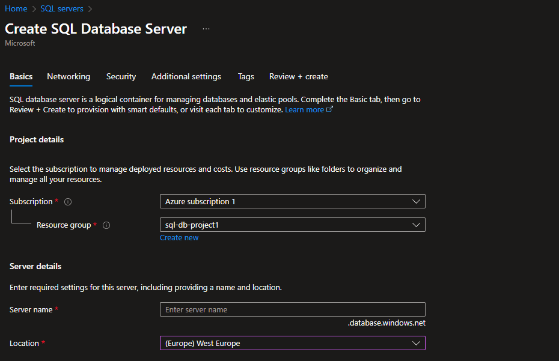
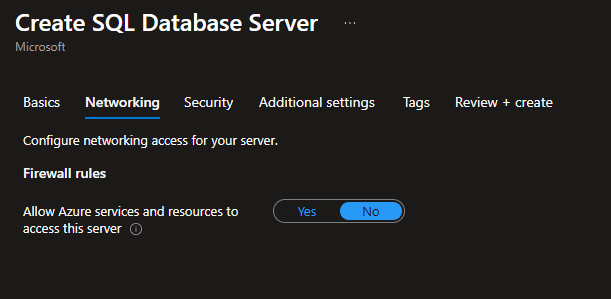
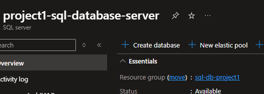
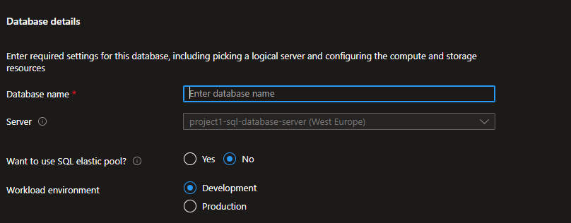
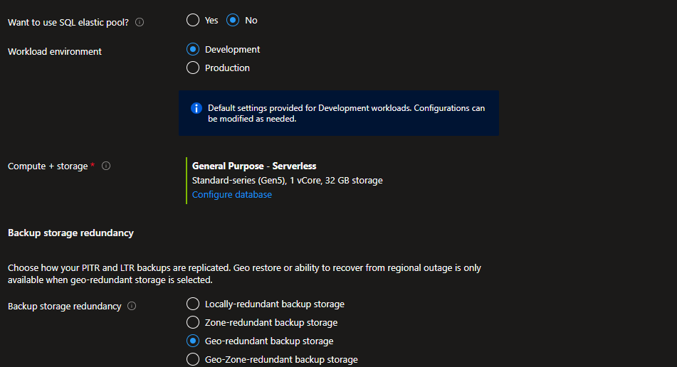
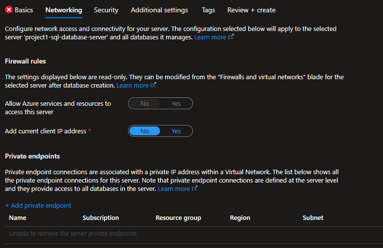
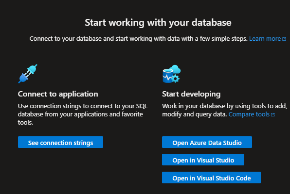
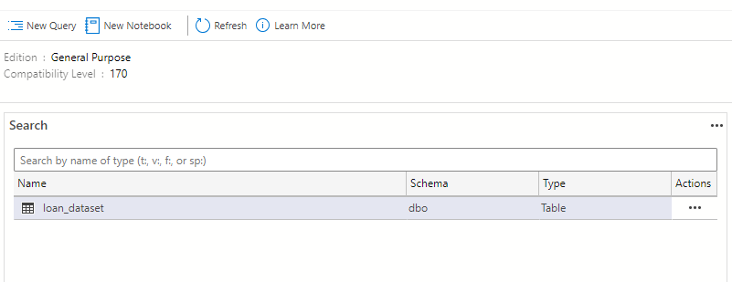
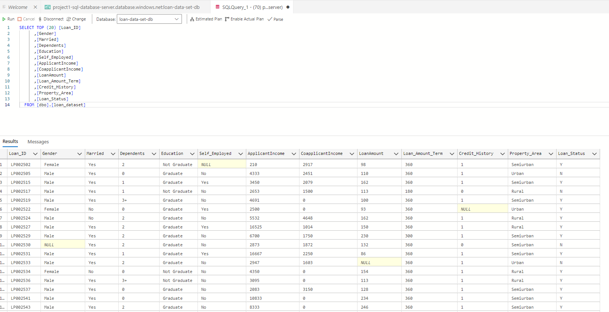

# Creating Azure SQL Server abd Azure SQL Batabase

##  Creating Azure SQL Server

- An Azure SQL Server is not a server: it's a logical container or namespace for managing Azure SQL Databases and authentication in Microsoft Azure.
- It provides a centralized endpoint for connectivity, firewall rules, and auditing policies.
- It provides database access and security management
  
## Step 1
- Login to portal.azure.com and open SQL Servers
- Create or add a resource group
- Fill in the required fields 

- Under Networking - > Enable: Allow Azure services and resources to access the server – we will need this to allow Azure Data Factory access to our data

- Review and create SQL Database Server

- **As mentioned above This is NOT your SQL DB – it’s a logical container ….**

## Step 2: Create SQL Database 

- Once your SQL Database Server is created open the resource and select create database

- Fill in the required fields and select the server you just created

- General Purpose – Serverless is sufficient with the Standard series and locally-redundant backup storage

- Enable: Allow Azure services and resources to access this server and for security add your public IP address to private endpoints tab
- Review and create – it will take a few minutes to create the SQL DB resource

- Once the SQL Database resource deployment is finsihed -> select go to resource and download Azure Data Studio and install if you have not already done so

- Run the script to ingest your dataset from jupyer notebook and you will see the new table with your dataset data inside

- Run a quick query to view your data
- Below is a screenshot of the top 20 data entires in the table

